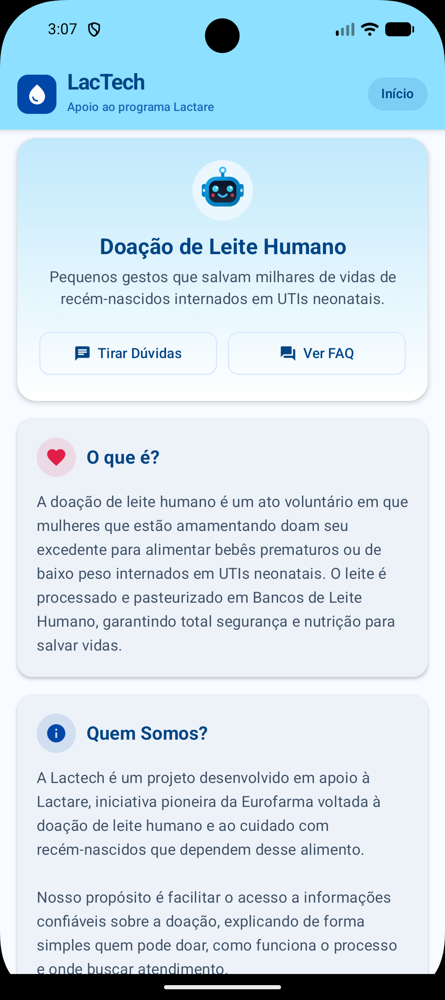
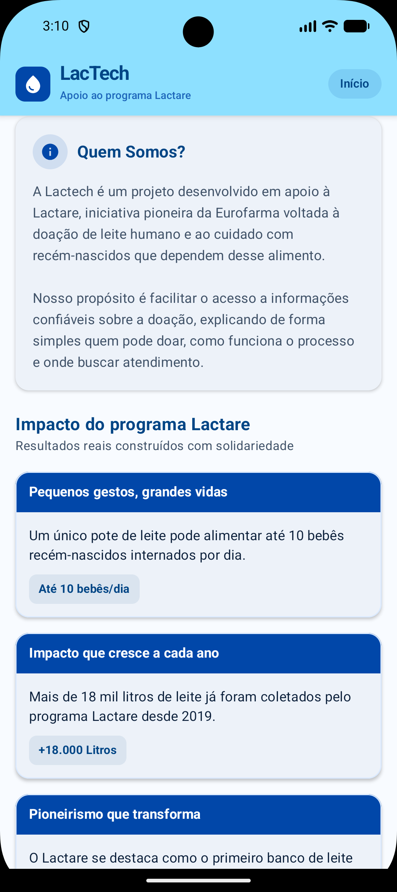
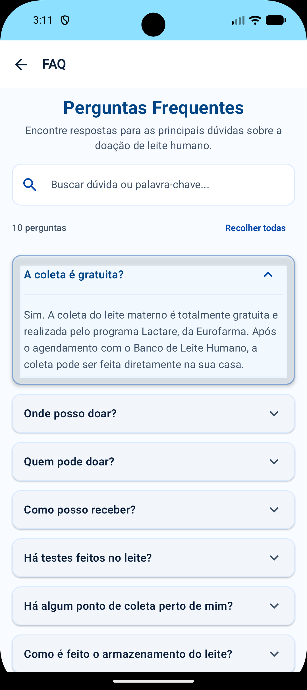
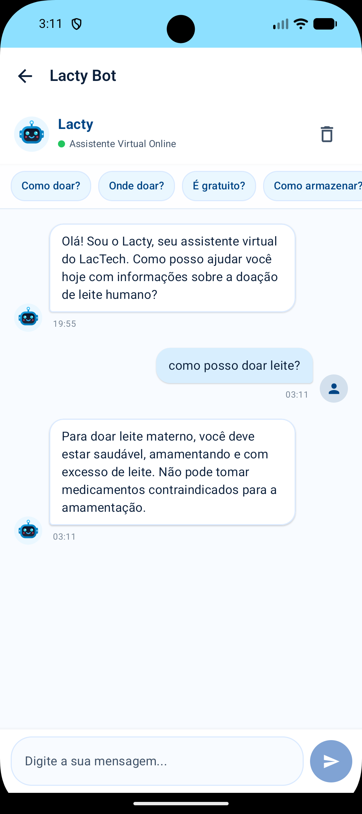

# LacTech

Aplicativo Android desenvolvido em apoio ao programa **Lactare**, iniciativa da Eurofarma voltada à doação de leite humano e ao cuidado com recém-nascidos que dependem desse alimento. O LacTech centraliza informações confiáveis sobre o processo de doação e oferece um canal de atendimento rápido para tirar dúvidas.

## Equipe

- Eduardo Caló
- Fernando Nakasone
- Gilmar Moura
- Vitor Garcia
- Caique Braga

## Sobre o projeto

A doação de leite humano é um ato voluntário em que mulheres que estão amamentando doam seu excedente para alimentar bebês prematuros ou de baixo peso internados em UTIs neonatais. O leite passa por rigorosas análises físico-químicas e microbiológicas e é pasteurizado em Bancos de Leite Humano antes de chegar aos bebês.

O objetivo do LacTech é facilitar o acesso a essas informações, explicando de forma simples quem pode doar, como funciona o processo, onde buscar atendimento e qual o impacto real do programa.

## Funcionalidades

- **Início**: apresentação do programa, explicação sobre o que é a doação de leite humano, quem está por trás do projeto e números de impacto do Lactare (litros coletados, doadoras cadastradas, bancos e postos de coleta pelo país).
- **FAQ**: lista de perguntas frequentes em formato acordeão, com busca por palavra-chave e opção de expandir/recolher todas as respostas de uma vez.
- **Lacty (Chatbot)**: assistente virtual que responde perguntas comuns sobre doação, coleta, armazenamento do leite e o programa, com sugestões rápidas de perguntas e histórico de conversa.

## Demonstração

| Início | Impacto do programa |
|---|---|
|  |  |

| FAQ | Lacty (Chatbot) |
|---|---|
|  |  |

## Tecnologias

- **Kotlin**
- **Jetpack Compose** para toda a interface
- **Navigation Compose** (rotas type-safe com `kotlinx.serialization`) para a navegação entre telas
- **StateFlow / ViewModel** para o gerenciamento de estado do chat
- **Material 3** como base de componentes visuais

## Arquitetura e navegação

A navegação segue o padrão de pilha do Navigation Compose, usando rotas type-safe:

- `Route.kt` define as rotas do app como objetos `@Serializable` (`HomeRoute`, `FaqRoute`, `ChatbotRoute`), em vez de strings soltas.
- `AppNavigation` concentra o `NavHost` e registra as rotas disponíveis através de `composable<Rota>`.
- Cada tela recebe funções de callback (`onNavigateToFaq`, `onNavigateToChatbot`, `onBackClick`) em vez do `NavController` diretamente, mantendo a lógica de navegação isolada no grafo.
- A tela inicial (Home) é o ponto de partida da pilha; FAQ e Chatbot são abertas a partir dela e possuem uma barra superior com botão de voltar, que retorna à tela anterior via `popBackStack()`.

## Estrutura de pastas

```
com.lactech.app
├── data                    # Modelos e provedores de dados (FAQ, mensagens do chat, cards de impacto)
├── ui
│   ├── components           # Componentes reutilizáveis (barra superior, bolhas de chat, cards, avatar do Lacty)
│   ├── navigation            # AppNavigation e definição das rotas (Route)
│   ├── screens                # Telas do app: HomeScreen, FaqScreen, ChatbotScreen
│   └── theme                   # Cores, tipografia e tema do Material 3
├── viewmodel                # ChatViewModel, responsável pela lógica do chatbot Lacty
└── MainActivity.kt
```

## Requisitos

- Android Studio (versão recente com suporte a Kotlin DSL)
- SDK mínimo: API 24 (Android 7.0 Nougat)

## Como executar

1. Clone ou baixe este repositório.
2. Abra o projeto no Android Studio.
3. Aguarde a sincronização do Gradle.
4. Execute em um emulador ou dispositivo físico com Android 7.0 ou superior.

## Video navegação
https://youtu.be/AP8GCb_CLBI

## Créditos

Projeto desenvolvido como parte de um curso de desenvolvimento Android com Kotlin e Jetpack Compose, em apoio ao programa Lactare, da Eurofarma.